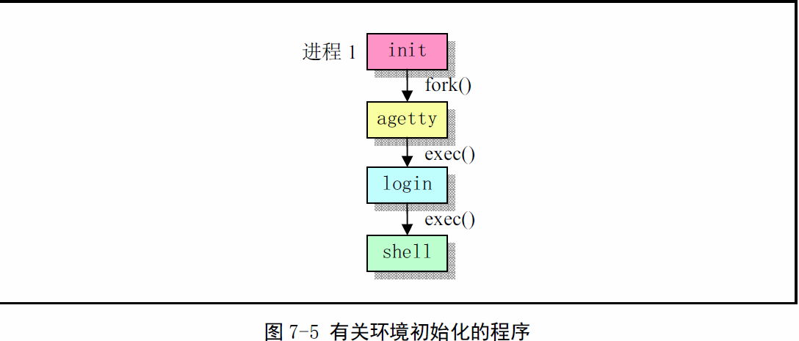

《Linux0.11内核完全注释》读书笔记之内核启动方式总结
----------------------------------------------
[TOC]

#Linux0.11启动方式

##BIOS启动
当PC电源打开后，80X86结构的CPU将自动进入实模式，并从0xFFFF0开始自动执行程序，
这通常是ROM-BIOS中的地址。PC机的BIOS将执行某些系统检测，并在物理地址0处开始初
始化中断向量。此后将可启动设备的第一个扇区读入内存绝对地址0x7C00处，并跳转到这
个地方。

##bootsect.s/setup.s

###bootsect.s
Linux最前面的部分是boot/bootsect.s，它将由BIOS读入到内存绝对地址0x7C00处，
当它被执行时就会把自己移动到内存绝对地址0x90000（576KB）处，并把启动设备后
2KB字节代码boot/setup.s读入到内存0x90200处，而内核其他部分（system模块）
则被读入到内存地址0x10000（64KB）开始处，因此从机器家电开始的执行顺序如下图。


###setup.s
在系统加载期间将显示信息“Loading...”。然后控制权将传递给boot/setup.s，这是
另一个实模式汇编语言程序。


启动部分识别主机的某些特性，如果需要会要求用书为控制台选择显示模式。然后将整
个系统从地址0x10000移至0x0000处，读取并为system模块保留系统参数，之后进入
保护模式并跳转至系统余下部分（0x0000处）。

##system模块加载

###head.s
head.s位于system模块头部。从这里开始，内核完全是在保护模式下运行。这个程序功
能比较单一。首先是加载各个数据段寄存器，重设中断描述符表idt，使各表项执行一个
只报错误的哑中断子程序ignore_int。然后重设gdt，检测A20地址线是否已真的开启，
如果没开启进入死循环。检测数学协处理器。
设置分页处理机制，将页目录表放在绝对物理地址0开始处（本程序会被覆盖）。最后，
head.s利用返回指令将预先放在堆栈中的/init/main.c程序的入口地址弹出，去运行
main()程序。

###main.c
main.c程序首先利用前面setup.s程序取得的系统参数设置系统的根文件设备号以及一
些内存全局变量。


####初始化基本环境
内核先进行所有方面的硬件初始化。包括陷阱门、块设备、字符设备和tty，包括人工设置
第一个任务(task 0)。待所有初始化完成后设置中断允许标志开启中断，并“手动”切换
到任务0中运行。


####task 0启动（idle进程）
直接fork()创建task 1，由于是内核创建的进程无法使用copy-on-write，又和内核
和之后新建的task 1共用堆栈，因此不能使用堆栈破坏其他程序运行，所以使用了内
联函数fork()和pause()。创建完task 1后就开始pause()死循环。

####task 1启动（init进程）
>**注意：** init进程由用户态进程idle进程创建，因此可以使用copy-on-write，
所以能使用堆栈 

在main()中已经进行了系统初始化，包括内存管理、各种硬件设备和驱动程序。init()
函数运行在任务0第一次创建的子进程（任务1）中。它首先对第一个将要执行的程序
（shell）的环境进行初始化，然后以非交互式shell方式加载该程序并执行之（见下方
task 2启动），并等待task 2结束。

init进程在task 2结束后再次创建新的shell进程，这次是作为登录shell运行/bin/sh
的。之后一直等待创建的子进程结束返回，对于所创建的子进程将关闭所有以前还遗留的
句柄（stdin, stdout， stderr），新创建一个会话并设置进程组号，然后重新打开
/dev/tty0作为stdin，并复制成stdout和stderr。再次执行/bin/sh。

wait()的另一个功能是处理孤儿进程。如果一个进程的父进程先终止了，那么这个进程
的父进程就会被设置为这里的init进程，并由init进程负责释放一个已经终止进程的任
务数据结构等资源。

####task 2启动（/bin/sh）
首次创建

	由init进程创建，关闭文件描述符0（stdin），以只读方式打开/etc/rc文件，并使用execve()
	函数将自身替换成/bin/sh程序，然后执行/bin/sh。由于这里sh的运行方式是非交互式的，因此	
	执行完rc文件中的命令后就会立即退出，进程2也随之结束。

非首次创建
	
	以登录shell运行，交互式shell。

#较新的启动方式
在前面的程序上，init()函数直接开始执行了命令解释程序（shell程序）/bin/sh，而
在实际可用的系统中却并非如此。为了能具有登录系统的功能和多人同时使用系统的能力，
通常的系统是在这里或类似地方执行系统初始化程序init.c，而此程序会根据系统/etc/
目录中配置文件的设置信息，对系统中支持的每个终端设备创建子进程，并在子进程中运
行终端初始化设置程序agettty（统称getty），gettty程序则会在终端上显示用户的登
录提示信息“login：”。当用户键入了用户名后，getty被替换成login程序。login程序验
证了用户输入口令的正确性后，最终调用shell程序，并进入shell交互工作界面。


init进程的主要任务是根据/etc/rc文件中设置的信息，执行其中设置的命令，然后根据
/etc/inittab文件中的信息，为每一个允许登录的终端设备使用fork()创建一个子进程，
并在每个新创建的子进程中运行getty。而init进程则调用wait(),进入等待子进程结束
状态。
每当一个子进程结束退出，就会根据返回的pid知道哪个对应终端的子进程结束了，因此
就会为相应终端设备再创建一个新的子进程。每个允许的终端设备都是中有一个对应的进
程为其等待处理。

当系统关闭时，init负责杀死所有其他进程，卸载所有的文件系统以及停止处理器的工
作，以及它配置成要做的工作。

##getty程序
gettty程序主要任务是设置终端类型、属性、速度和线路规程。它打开并初始化一个tty
端口，显示提示信息，并等待用户键入用户名。该程序只能由超级用户执行。通常，若
/etc/issue文本文件存在，则getty会首先显示其中的文本信息，然后显示登录提示信
息，读取用户输入的登录名，并执行login程序。

##login程序
login程序主要用于要求登录用户输入密码。根据用交输入的用户名，它从口令文件passwd
中取得对应用户的登录项，然后调用getpass()以显示“password：”提示信息，读取用户
键入的密码，然后使用加密算法对键入的密码进行加密处理，并与口令文件中该用户项中
pw_passwd字段作比较。如果登录失败，login程序会退出执行并被父进程init的wait()
接收，init会根据记录下来的信息再次创建一个子进程，并在进程中针对该终端设备再次
执行getty。

如果用户键入的密码正确，则login会把当前工作目录修改成口令文件中指定的用户起始
目录。并把对应终端的访问权限修改成用户读/写和组写，设置进程的组ID。然后利用所得
的信息初始化环境变量信息，如（HOME=）。接着显示/etc/motd(message-of-the-day)
文件中的文本信息，并检查并显示该用户是否有邮件的信息。最后login程序改变成登录
用户的用户ID并执行用户口令文件中该用户项指定的shell程序，如bash后csh等。如果
没有指定shell，则会使用默认/bin/sh。

##shell程序
在登录过程中login开始执行shell时，所带参数argv[0]的第一个字符是‘-’，表示该
shell作为一个登录shell被执行。此时shell程序会根据该字符，执行某些与登录过程
相应的操作。登录shell首先从/etc/profile文件以及.profile文件（若存在）读取
命令并执行。如果在进入shell时设置了ENV环境变量或者在.profile中设置了该变量，
则shell下一步会从该变量命名的文件中读取命令并执行。因此用户应该把每次登录是
都要执行的命令放在.profile文件中，而把每次运行shell都要执行的命令放在ENV变
量指定的文件中。

如放在.profile中：
```shell
ENV=$HOME/.anyfilename; 
export ENV
```


