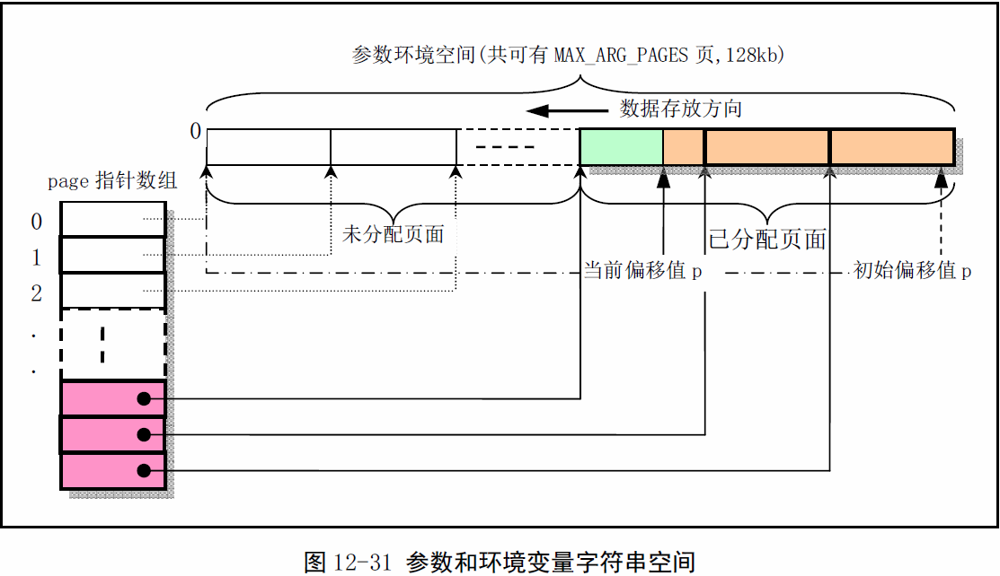
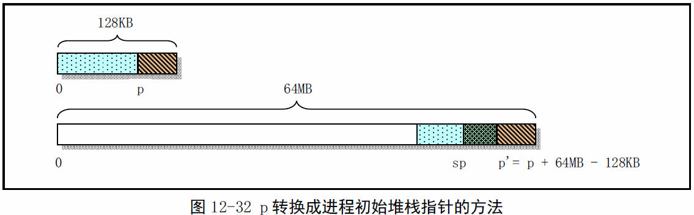
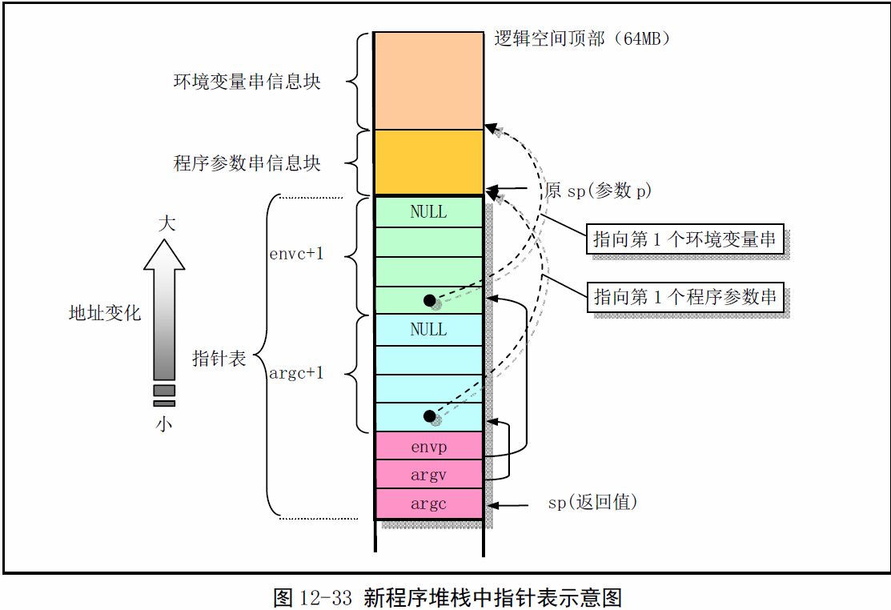

《Linux0.11内核完全注释》读书笔记之exec.c
----------------------------------------------
[TOC]

本源程序实现对二进制可执行文件和shell脚本文件的加载和执行。其中主要函数是
do_execve()，它是系统中断调用(int 0x80)功能号__NR_execve()调用的C处理函数，
是exec()函数簇的内核实现函数。其它5个exec一般在库中实现，并最终调用这个系统调用。
>**注：** exec系统中断调用中先调用sys_execve(),然后在sys_execve()中调用
do_execve()，sys_execve在system_call.s中被定义成了_sys_execve汇编函数。

#申请页表
在do_execve()执行过程中，系统会清理fork()复制的原程序的页目录和页表项，并释放对
应页面。系统仅为新加载的程序代码重新设置进程数据结构中的信息，申请和映射了命令行参
数和环境参数块所占的内存页面，以及设置了执行代码执行点。此时内核并不执行文件所在块
设备上加载程序的代码和数据。当该过程返回时即开始执行新的程序，但一开始执行肯定会引
起缺页异常中断发生。因为代码和数据还未被从块设备上读入内存。此时缺页异常处理过程或
申请内存页面，并从块设备上读入引起异常的制定页面。同时还为该线性地址设置对应的页目
录项和页表项。这种加载加载执行文件的方法称为需求加载（Load on demand）。

#堆栈指针sp的计算
在初始时，程序定义了一个指向该空间末端（128KB-4字节）出空间内偏移值p，该偏移值随
着存放数据的增多而后退，p明确指出了当前参数环境空间还有剩余多少可用空间。
copy_string()函数用于从用户内存空间拷贝命令行参数和环境字符串到内核空闲页面中。

执行完copy_string()后，p‘将被调整为从进程逻辑地址空间开始出算起的参数和环境变量起始
处指针，见p'。p'左边部分还将使用create_table()函数来存放参数和环境变量的一个指针表，
并且p'将再次向左调整为指向指针表起始处。再报所得指针进行页面对齐，最终得到初始堆栈
指针sp。

>**注意：** env和arg参数列表最高地址处都是以NULL结束。

#do_execve返回
函数do_execve()最后返回时，会把原调用系统中断程序在堆栈上的代码指针eip替换为指向新
执行程序的入口点，并将栈指针替换为新执行文件的栈指针esp。(PCB中的相应内容也被修改了)此后这次系统调用的返回指令最终会弹出这些栈中的数据，并使得CPU去执行新执行文件。

>**Linus:** 需求时加载实现于1991.12.1-只需将执行文件头部读进内存而无需将整个执行文
件加载进内存。执行文件的i节点被放在当前进程的可执行字段中“current->executable”，
页异常会进行执行文件的释迦加载操作。这很完美。
我可以再一次自豪的说，linux经得起修改：只用了不到2小时的工作就完全实现了需求加载处理。 

