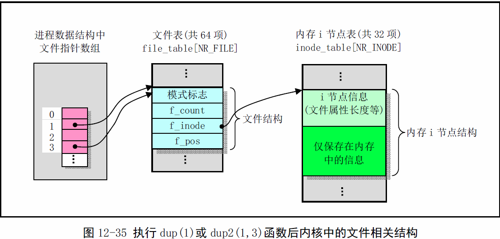

《Linux0.11内核完全注释》读书笔记之fcntl.c
----------------------------------------------
[TOC]

由AT&T的系统开始采用fcntl()函数主要用于修改已打开文件的属性。函数dup(fd)就等效于fcntl(fd,F_DUPFD,0);而函数dup2(fd,newfd)则等效于语句
“close(newfd);fcntl(fd,F_DUPFD,newfd);”


```C
//fd是想要复制的文件描述符，arg是指定的最小文件描述符。
static int dupfd(unsigned int fd, unsigned int arg)
{
    if(fd>=NR_OPEN||!current->filp[fd])
        return -EBADF;
    if(arg>=NR_OPEN)
        return -EINVAL;
    //在当前进程文件结构指针数组中找索引号（文件描述符）大于或等于arg但没使用的项。
    while(arg<NR_OPEN)
        if(current->filp[arg])
            arg++;
        else
            break;
    if(arg>=NR_OPEN)
        return -EMFILE;
    //找到空闲项，关闭close_on_exec位，即exec时不关闭dup()创建的文件描述符。
    //令该文件结构指针等于原fd的指针，并将文件引用计数增1.最后返回新文件描述符arg
    current->close_on_exec &= ~(1<<arg);
    (current->filp[arg] = current->filp[fd]->f_count++);
    return arg;
}

int sys_dup2(unsigned int oldfd, unsigned int newfd)
{
    sys_close(newfd);
    return dupfd(oldfd, newfd);
}

int sys_dup(unsigned int fildes)
{
    return dupfd(fildes, 0);
}

int sys_fcntl(unsigned int fd, unsigned int cmd, unsigned long arg)
{
    struct file *filp;
    if(fd>NR_OPEN||!(filp=current->filp[fd]))
        return -EBADF;
    switch(cmd){
        case F_DUPFD:
            return dupfd(fd, arg);
        case F_GETFD:
            return (current->close_on_exec>>fd)&1;
        case F_SETFD:
            ......
        ......
        defaule:
            return -1;
    }
}
```

