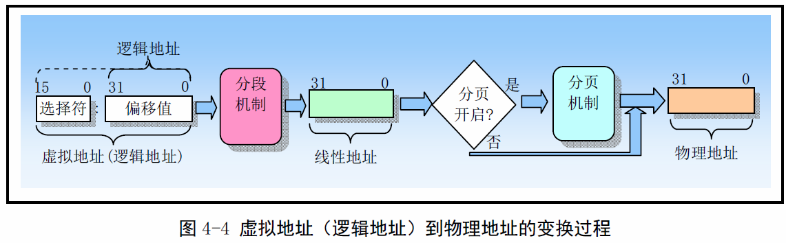

《Linux0.11内核完全注释》读书笔记之fork.c
----------------------------------------------
[TOC]

fork.c为do_fork提供了必须的几个函数，do_fork定义在system_call.s中。
#copy_mem
copy_mem在复制进程时使用，由于linux0.11只有一张页目录表，因此需要把不同进程映射
到不同的线性地址空间中去，copy_mem利用了CPU寻址的分段机制特点，把段描述符基地址
指向64MB*nr的位置，当进程在寻址时利用段地址和逻辑地址组合产生线性地址，这时线性
地址被映射到了不同的区间，避免了冲突。但是在新的linux中所有的段地址都被设置成了0，
因此不同进程会产生相同的线性地址，那linux是怎么避免地址冲突的呢？每个进程都有自己
的页目录表，相同的线性地址会被映射到不同的物理地址或共享物理地址，避免了物理地址冲
突。

```C
int copy_mem(int nr, struct task_struct *p)
{
    unsigned long old_data_base, new_data_base, data_limit;
    unsigned long old_code_base, new_code_base, code_limit;
    //取得当前进程局部描述符表中代码段描述符和数据段描述符中的段限长。
    //0x0f是代码段选择符，0x17是数据段选择符。然后去当前进程代码段和数据
    //段在线性得知空间中的基地址。由于Linux0.11不支持代码和数据段分立的情况，
    //因此需要检查
    code_limit=get_limit(0x0f);
    data_limit=get_limit(0x17);
    old_code_base = get_base(current->ldt[1]);
    old_data_base = get_base(current->ldt[2]);
    if(old_data_base!=old_code_base)
        panic("We don't support separate I&d");
    if(data_limit<code_limit)
        panic("bad data_limit")
    //然后设置创建的新进程在线性地址空间中的基地址等于（64MB*nr），并用该值设置
    //新进程局部描述符表中段描述符中的基地址。接着设置页目录表项和页表项。
    new_data_base = new_code_base = nr*0x4000000;
    p->start_code = new_code_base;
    set_base(p->ldt[1], new_code_base);
    set_base(p->ldt[2], new_data_base);
    if(copy_page_tables(old_data_base,new_data_base,data_limit){
        free_page_tables(new_data_base,data_limit);
        return -ENOMEM;
    }
    return 0;
}
```

#copy_process
>**注意：** 进程刚创建时是TASK_UNINTERRUPTIBLE状态，防止新进程被运行，到初始化
>完成才设置成TASK_RUNNING。那么该函数被中断调度后如何恢复呢？要注意该函数还是属于
>当前进程的,只是处于内核态，因此该函数是随着当前进程被调度的。

```C
int copy_process(int nr,long ebp,long edi,long esi,long gs,long none,
    long ebx,long exc,long edx,
    long fd,long es,long ds,
    long eip,long cs,long eflags,long esp,long ss)
    {
        struct task_struct *p;
        int i;
        struct file *f;
        p=(struct task_struct *)get_free_page(); //内存数据结构在主内存区域申请
        if(!p)
            return -EAGAIN;
        task[nr]=p;
        *p = *current; //注意！这样做不会复制超级用户堆栈（只复制进程结构）
        p->state = TSAK_UNINTERRUPTIBLE;//设置新创建的进程不可调度，并不是当前进程
        p->pid = last_pid;
        p->father = current->pid;
        p->counter = p->priority;
        p->signal = 0;
        p->alarm = 0;
        p->leader = 0; //进程领导权不能继承

        p->utime = p->stime = 0
        p->cutime - p->cstime = 0;
        p->start_time = jiffies;
        p->tss.back_link = 0;
        p->tss.esp0 = PAGE_SIZE + (long)p;
        p->tss.ss0 = 0x10;
        p->tss.eip = eip;
        ...
        p->tss.es = es & oxffff; //段寄存器仅16位有效。
        ...
        p->tss.ldt = _LDT(nr);    //任务局部表描述符的选择符（LDT描述符在GDT中）
        p->tss.trace_bitmap = 0x80000000;

        if(last_task_used_math == current)
            __asm__("clts; fnsave %0"::"m" (p->tss.i387));
        if(copy_mem(nr,p)){
            task[nr] = MULL;
            free_page((long)p);
            return -EAGAIN;
        }

        for(i=0;i<NR_OPEN;i++){
            if(f=p->filp[i])
                f->f_count++;
        }
        if(current->pwd)
            current->pwd->i_count++;
        if(current->root)
            current->root->i_count++;
        if(current->executable)
            current->executable->i_count++;

        set_tss_desc(gdt+(nr<<1)+FIRST_TSS_ENTRY, &(p->tss));
        set_ldt_desc(gdt+(nr<<1)+FIRST_LDT_ENTRY, &(p->ldt));
        p->state = TASK_RUNNING;       //最后才将任务置成就绪态
        return last_pid;       
    }

    /* head.h gdt指向desc_table */
    typedef struct desc_struct {
    unsigned long a,b;
    } desc_table[256];

    /* sched.h */
    #define FIRST_TSS_ENTRY 4
    #define FIRST_LDT_ENTRY (FIRST_TSS_ENTRY+1)
```

```C
//system_call.s
.align 2
_sys_fork:
    call _find_empty_process
    testl %eax,%eax
    js 1f
    push %gs
    pushl %esi
    pushl %edi
    pushl %ebp
    pushl %eax
    call _copy_process
    addl $20,%esp
1:  ret
```

