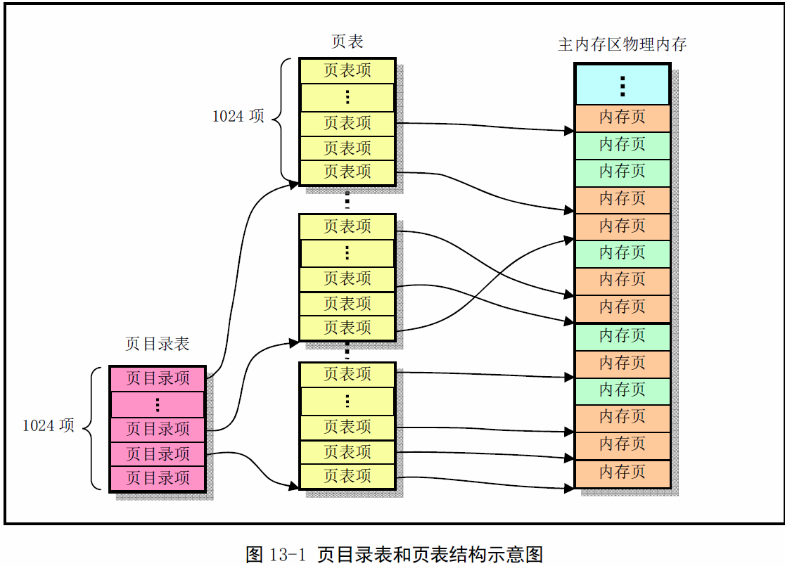
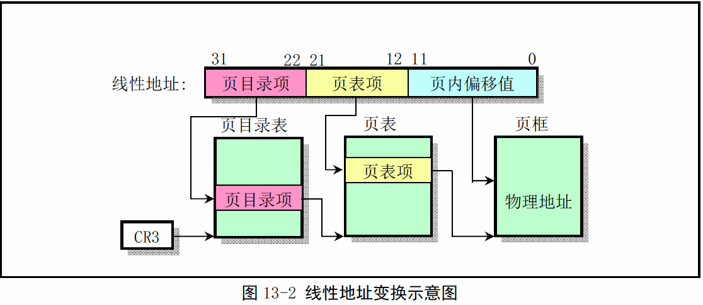
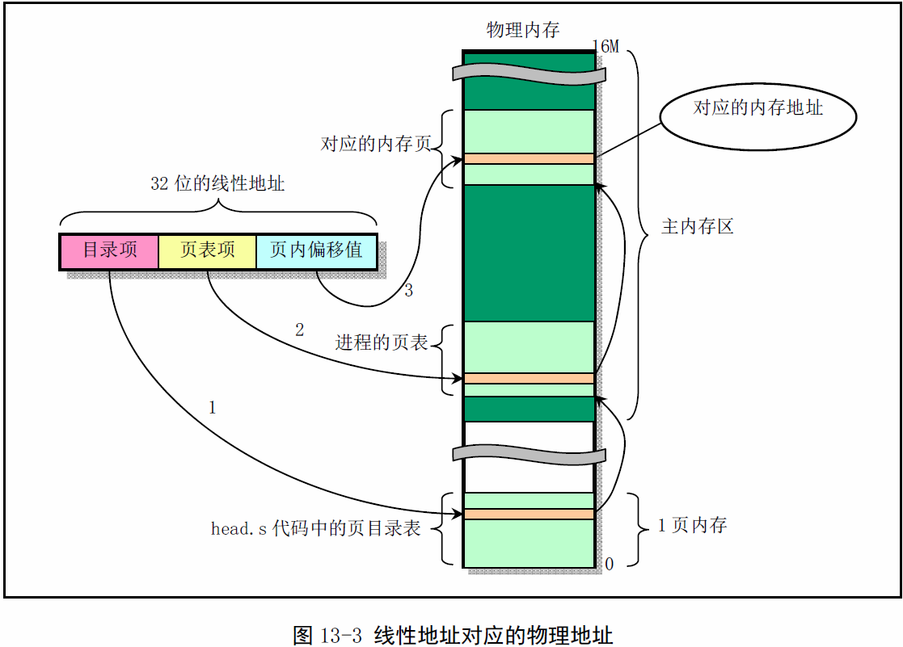
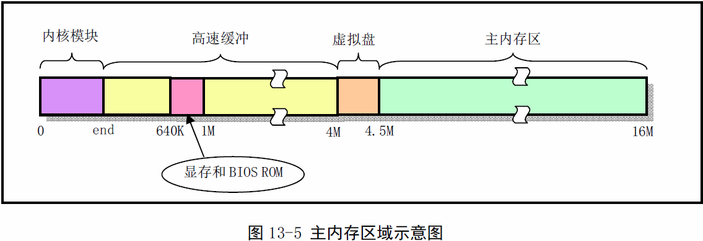

《Linux0.11内核完全注释》读书笔记之mm
----------------------------------------------
[TOC]

在linux0.11内核中，所有进程都是用一个页目录表，而每个进程都有自己的页表。
内核代码和数据段长度是16MB，使用了4个页表（即4个页目录项）。这4个页表直接
位于页目录表后面，参见head.s第109--125行。（新的内核每个进程有自己的页表，
有4G线性空间）
对于应用程序或内核其他部分来讲，在申请内存是使用的是线性地址。接下来就是线
性地址通过页表映射到一个物理地址上。

反之，如果需要从一个已知被使用的物理内存页地址寻找相应的线性地址，则需要对
整个页目录表和所有页表进行搜索。若该物理内存页被共享，我们可能会找到多个对
应的线性地址来。

一个系统可以存在多个页目录表，但是同一时刻只有一个页目录表可用。当前页目录表
用CPU的具存期CR3来确定，它存储当前页目录表的物理内存地址。

在对一夜内存进行读或写操作之前，CPU将设置相关的目录和二级页表项的已访问位。
在想一个二级页表所涵盖的地址进行写操作之前，处理器将设置该二级页表项的已修改
位，而页目录项中的已修改位是不用的。

#Linux中物理内存的管理和分配

每个进程在线性地址中都是从nr*64MB的地址位置开始(nr是任务号)，占用逻辑地址空间
的范围是64MB（也是线性地址范围）。

#页面出错异常处理
在运行于开启了分页机制（PG=1）的状态下，若CPU在执行现行地址变换到屋里地址的过程
中检测到以下条件，就会引起页出错异常中断int14：
- 地址变化过程中用到的页目录项或页表项中存在位（P）等于0；
- 当前执行程序没有足够权限访问指定页面。
根据缺页或写保护异常，memory.c的确也处理函数do_no_page()或写保护函数do_wp_page()
函数会被调用。

#写时复制（copy on write）机制
写时复制是一种推迟或免除复制数据的一种方法。此时内部并不复制进程的整个地址空间中的
数据，而是让父子进程共享一个拷贝。fork()函数会让子进程以制度方式共享父进程A的物理
页面。同时将父进程对这些物理页面的访问权限也设成只读。这样当一方对共享物理页面执行写
操作是，都会产生页面出错异常中断(int 14)，此时do_wp_page()来试图解决这个异常。这
就是写时复制。

do_wp_page()会取消共享操作并复制一新的物理页面，是父子进程各自拥有一块内容相同的物
理页面，并标记成可写的。最后从异常处理函数中返回时，CPU就会重新执行干菜导致异常的写入
操作指令，使进程能够继续执行下去。

因此进程在自己的虚拟地址范围内进行写操作时，就会使用上面这种被动的写时复制操作，即：
写操作->页面异常中断->处理写保护异常->重新执行写操作指令。而在系统内核代码中，当在
某个进程的虚拟地址范围内执行写操作时，进程的内核会通过verify_area()
函数首先主动的调用内存页面验证函数write_verify()，来判断是否有页面共享的情况存在，
如果有，就进行页面的写时复制操作。

另外，在Linux0.11内核中，在内核代码地址空间（线性地址<1MB）执行fork()来创建进程并
没有采用写实复制技术。因此当进程0在内核空间产生进程1（init）时将使用同一段代码和数据
段。但由于进程1复制的页表项也是制度的，因此当进程1需要执行堆栈（写）操作是也会引起页
面异常，从而在这种情况下内存管理程序也会在主内存区中为该进程分配内存。

#需求加载（Load on demand）机制
在使用execve系统调用加载运行文件系统上的文件时，内核除了在CPU的4G线性空间中为对应进程分配了64MB的连续空间，并为其环境参数和命令行参数分配和映射了一定数量的物理内存页面外，实际上并没有给执行那个程序分配其他任何物理内存页面。因此一旦该程序从设定的入口执行点开始运行就会引起CPU产生一个缺页异常。此时内存的缺页异常处理程序才会根据引起缺页异常的具体线性地址把执行文件中相关代码页从文件系统中加载到物理内存页面中，并映射到进程逻辑地址中指定指定的页面位置处。返回重新执行引起异常的指令，使得执行程序能够继续执行。

这种尽在实际需要时才加载执行文件中页面的方法被称为需求加载技术或需求分页技术。

有点是调用execve()系统后能让执行程序立刻开始运行。缺点是被加载文件需要满足一定格式。

