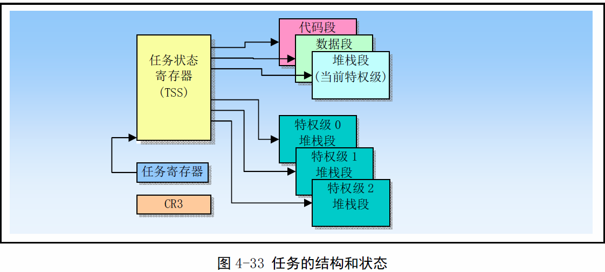

《Linux0.11内核完全注释》读书笔记之sche.c
-----------------------------------------
[TOC]

当前进程睡眠，并醒来后唤醒参数中的进程。
```c
void sleep_on(struct task_struct **p)
{
	struct task_struct *tmp;
	if(!p)
		return;
	if(current == &(init_task.task))
		panic("task[0] trying to sleep");
	tmp = *p;
	*p = current;
	current->state = TASK_UNINTERRUPTIBLE;
	scheule();
	if(tmp)
		tmp->state=0;    //running
}
```
>**注意：**同一时间能有多个进程处于running状态。

#任务切换
Linux使用jmp指令明确跳转到一个任务，使用了TSS。所有这些调度任务执行的方法都会使用一个指向任务门或任务TSS段的选择符来确定一个任务。当使用CALL或JMP调度一个任务时，指令中的选择符即可以直接选择任务的TSS，也可以选择存放TSS选择符的任务们。当调度一个任务来处理一个中断或异常时，那么IDT中该中断或异常表项必须是一个任务门，并且其中含有中断或异常处理任务的TSS选择符。

当调度一个任务执行时，当前正在运行的任务和调度任务之间会自动发生任务切换操作。在任务切换期间，当前运行任务的执行环境（成为任务的状态或上下文）会被保存到它的TSS中并且暂停该任务的执行。此后新调度任务的上下文会被加载进处理器中，并且从加载的EIP执行的指令处开始执行新任务。

>**注意：** 进程间任务切换靠TSS，进程内切换函数靠堆栈。

