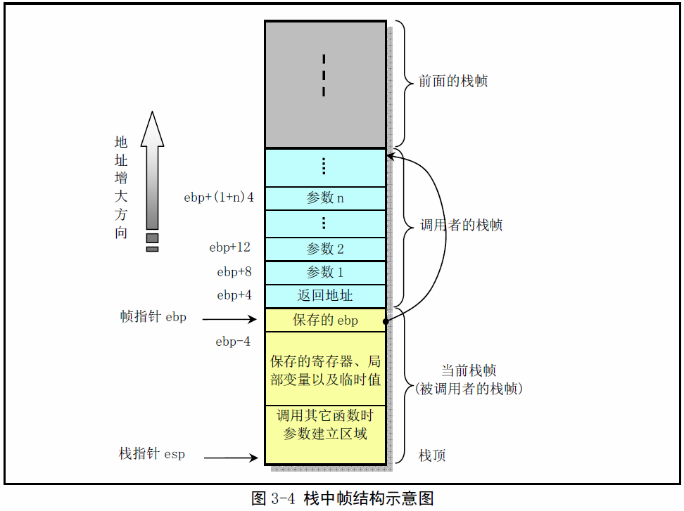
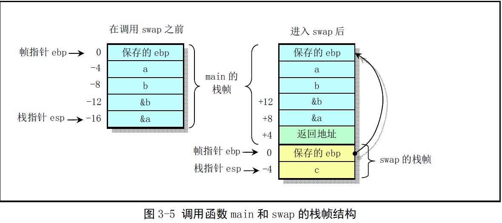

《Linux0.11内核完全注释》读书笔记2
----------------------------------------------
[TOC]
##C与汇编程序相互调用

###C语言函数调用机制
函数调用操作包括从一块代码到另一块之间的双向数据传递和执行控制转移。数据传递通过函数参数和返回值来进行。另外，我们还需要在进入函数时为函数的局部变量分配存储空间，并且在退出函数时收回这部分空间。Inter80X86CPU为控制传递提供了简单那的指令，而数据的传递和局部变量存储空间的分配和回收则通过栈操作来实现。

####栈帧结构和控制转移权方式
大多数CPU上的程序实现使用栈来支持函数调用操作。栈被用来传递函数参数、存储返回信息、临时保存寄存器原有值易被恢复以及用来存储局部数据。单个函数调用操作所使用的栈部分被称为栈帧（Stack frame）结构。栈帧结构钢的两端由两个指针来制定。寄存器ebp通常用作帧指针（frame pointer），而esp则用作栈指针（stack pointer）。在函数齿形过程中，栈指针esp会随着数据的入栈和出栈而移动，因此函数中对大部分数据的访问都基于帧指针ebp进行。

栈是往低(小)地址方向扩展的，而esp指向当前栈顶处的元素。通过使用push和pop指令我们可以把数据压入栈中或从栈中弹出。对于没有指定初始值的数据所需要的存储空间，我们可以通过把栈指针递减适当的值来做到。类似的，通过增加栈指针值我们可以回收栈中已分配的空间。
若返回值是一个整数或一个指针，那么寄存器eax将被默认用来传递返回值。
Intel CPU采用了所有函数必须遵守的寄存器用法同意惯例。
该惯例指明，寄存器eax、edx和ecx的内容必须由调用者自己负责保存。寄存器ebx、esi和edi的内容必须由被调用者来保护。

####函数调用举例
作为一个例子，我们来观察下面C程序exch.c中函数调用的处理过程。

```c
void swap(int *a, int *b)
{
	int c;
	c = *a; *a = *b; *b = *c; 
}
int main()
{
	int a,b;
	a = 16; b=32;
	swap(&a, &b);
	return (a-b);
}
```


####main()也是一个函数
gcc编译器并不能产生最高效的代码，这也是为什么某些关键代码需要直接使用汇编语言的原因之一。
另外，上面提到的C程序的主程序main()也是一个函数。这是因为在编译链接时它会作为crt0.s汇编程序的函数被
调用。crt0.s是一个桩程序(stub),名字中的“crt”是“C run-time”的缩写。
该程序的目标文件将被链接在每个用户执行程序的开始部分，主要用于设置一些初始化全局变量等。
linux0.11中crt0.s汇编程序见如下所示：

```c
.text
.globl _environ				#声明全局变量 _environ（对应C程序中的environ变量）。

__entry:					#声明代码入口标号
	movl 8(%esp); %eax		#取程序的环境变量指针envp并保存在_environ中。
	movl %eax, _environ 	#envp是execve()函数在加载执行文件是设置的
	call _main				#调用主程序，返回值在eax中
	pushl %eax				#压入返回值作为exit()函数的参数并调用该函数
1:	call _exit				
	jmp 1b					#控制应该不会到达这里，若到达这里则继续执行exit()
.data
_environ:					#定义变量 _environ,为其分配一个长字空间。
	.long 0
```
通常使用gcc编译链接生成执行文件时，gcc会自动把该文件的代码作为第一个模块链接在可执行程序中。
在编译是使用显示详细信息选项'-v'就可以明显看出这个链接操作过程。

>**注意：** gcc编译器(2.x)已经把这个crt0扩展成几个模块，
crt1.o、crti.o、crtbegin.o、crtend.o和crtn.o。gcc的配置文件specfile致死那个了链接数序，其中
crt1.o、crti.o和crtn.o有C库提供，其他是C++语言的启动模块。

