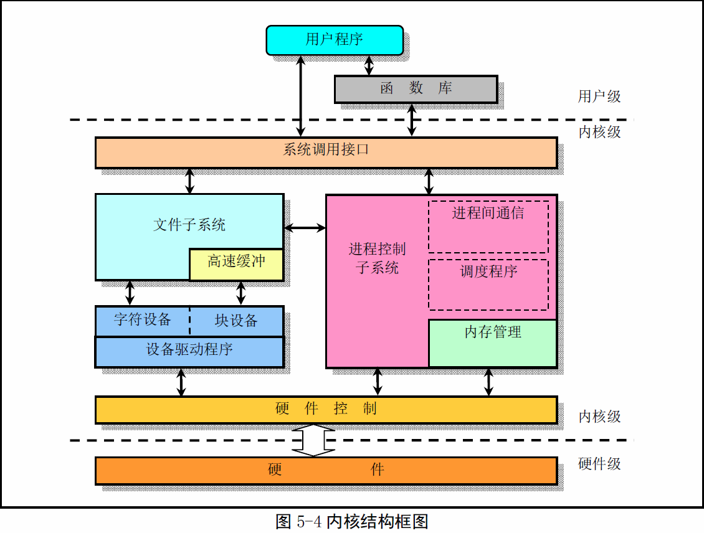
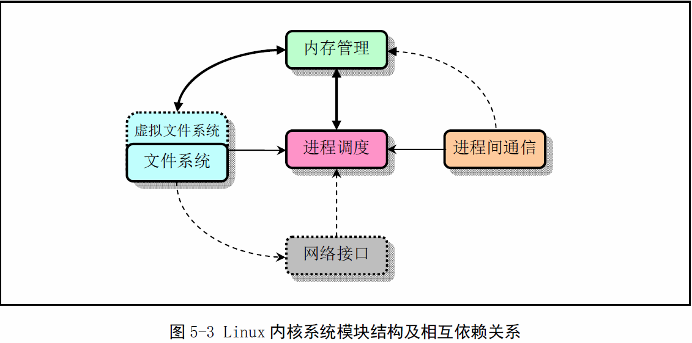

《Linux0.11内核完全注释》读书笔记3
----------------------------------------------
[TOC]

一个完整可用的操作系统主要由4部分组成：硬件、操作系统内核、操作系统服务和用户应用
程序。

linux内核的主要用途是为了与计算机硬件进行交互，实现对硬件的编程控制和接口操作，
调度对硬件资源的访问，并为计算机上的用户程序提供一个高级的执行环境和对硬件的虚拟
接口。

##Linux内核模式
>Linux采用了单内核模式，优点是内核代码结构紧凑、执行速度快、不足之处主要是层次结
构性不强

在单内核模式的系统中，操作系统所提供服务的流程为：应用住程序使用指定的参数值执行
系统调用指令(int x80)，是CPU从用户态(User Mode)切换到核心态(Kernel Model)，然
后操作系统根据具体的参数值调用特定的系统调用服务程序，然后服务程序则根据需要再调
用底层的一些支持函数以完成特定的功 能。在完成了应用程序所要求的服务后，操作系统又使
CPU从核心态切换回用户态，从而返回到应用程序中继续执行后面的指令。因此概要的讲，
单内核模式的内核可粗略分为三个层次：调用服务的主程序层、执行系统调用的服务层和支持
系统调用的底层函数。

##Linux内核系统体系结构
Linux内核主要由5个模块构成: 进程调度模块、内存管理模块、文件系统模块、进程间通信模块
和网络接口模块。
这几个模块之间的依赖关系下图。其中连线代表他们之间的依赖关系，虚线和虚框部分表示
Linux0.11中还未实现的部分。

由图可以看出，所有的模块都与进程调度模块存在依赖关系。
若从单内核模式结构模型出发，我们还可以根据Linux0.11内核源代码的结构将内核主要模块绘制
成如下结构。

除了这些图中已经给出的依赖关系，所有这些模块还会依赖内核中的通用资源。这些资源包括内核
所有子系统都会调用的内存分配和回收函数、打印警告或出错函数以及一些系统调试函数。

##Linux内核对内存的管理和使用

