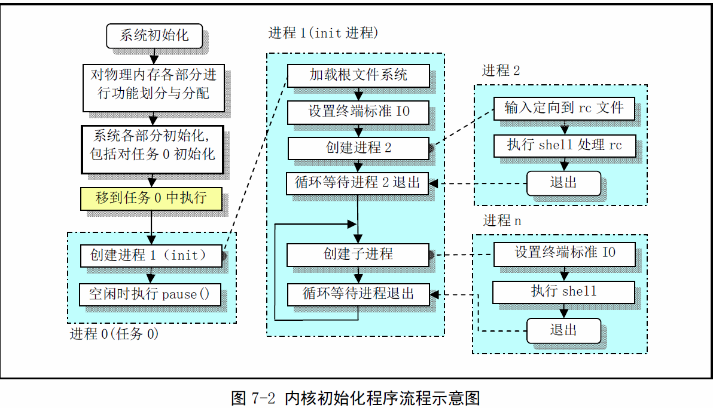

《Linux0.11内核完全注释》读书笔记4
----------------------------------------------
[TOC]

#初始化程序

##main.c程序

###功能描述
main.c程序利用setup.s取得系统参数并设置系统根文件设备号以及一些内存全局变量。
这些变量指明了内存的分配方式。

在整个内核完成初始化后，内核将执行权限切换到了用户模式。此时mian.c工作在任务0中。
然后系统第一次调用进程创建函数fork()，创建出一个用于运行init()的子进程（init进程）。

main.c程序首先确定如何分配使用系统物理内存，然后调用内核各部分的初始化函数分别对内存
管理、中断处理、块设备和字符设备、进程管理以及硬盘和软盘硬件进行初始化处理。完成这些操作
系统各部分处于可运行状态。此后程序把自己“手工”移动到任务0中运行，并使用fork()调用首次
创建出进程1（init进程），并在其中调用init()函数。在该函数中程序将继续进行应用环境的初
始化并执行shell登录程序。而原进程会在系统空闲是被调度，因此进程0通常称为idle进程。此时
进程0仅执行pause()调用，并又会调用调度函数。

init()函数的功能可分为4个部分：
-	安装根文件系统
-	显示系统信息
-	运行系统初始资源配置文件rc中的命令
-	执行用户登录shell程序

>**注意:** linux下进程调度不是单独进程，而是系统定时时钟中断处理函数实现的。