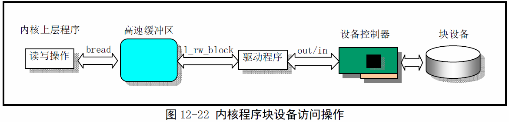

《Linux0.11内核完全注释》读书笔记之buffer.c
----------------------------------------------
[TOC]

```c
//虽然是在关闭中断后睡眠的，但是不会影响其他进程的中断响应。因为
//每个进程都在自己的TSS段中保存了标志寄存器EFLAGS值，所以进程切
//换时CPU中当前EFLAGS的值也随之改变。
static inline void wait_on_buffer(struct buffer_head *bh)
{
	cli();						//关中断。
	while(bh->b_block)			//如果已被上锁则睡眠，等待解锁。
		sleep_on(&bh->b_wait);	
	sti();						//开中断。
}
```

内核程序对**块设备**的访问都要经过高速缓冲这一环节，除驱动程序以外，内
核其他上层程序对**块设备**的读写操作需要经过高速缓冲区管理程序来间接实现。


对于更新和同步操作，其主要作用是让内存中的一些缓冲块内容与磁盘等块设
备上的信息一致。sync_inodes()的主要作用是吧i节点表inode_table中的一
些缓冲块内容与磁盘等块设备上的信息一致。但需要巾帼系统高速缓冲区这一环
节。实际上，任何同步操作都被分成了两个阶段：
1.数据结构信息与高速缓冲区中的缓冲块同步问题，有驱动程序独立负责；
2.高速缓冲区中数据块与磁盘对应的同步问题，由这里的缓冲管理程序负责。

```c
int sys_sync(void)
{
	int i;
	struct buffer_head *bh;
	//首先调用i节点同步函数，把内存i节点表中所有修改过的i节点写入高速缓
	//冲中。然后扫描所有高速缓冲区，对已被修改的缓冲块产生写盘请求，将缓
	//冲中数据写入盘中，做到高速缓冲中的数据与设备中的同步。
	sync_inodes();
	bh = start_buffer;
	for(i=0; i<NR_BUFFERS; i++,bh++){
		wait_on_buffer(bh);
		if(bh->b_dirt)
			ll_rw_block(WRITE, bh);  //只是块设备，字符设备没用高速缓冲
	}
	return 0;
}
```

以下代码来自inode.c

```c
void sync_incdes(void)
{
	int i;
	struct m_inode *inode;
	inode = 0+inode_table;
	for(i=0; i<NR_INODE; i++,inode++){
		wait_on_inode(inode);
		if(inode->i_dirt&&!inode->i_pipe)
			write_inode(inode);			 	//写盘，实际写入缓冲区中
	}

}
```