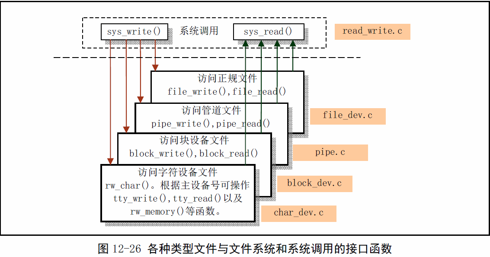
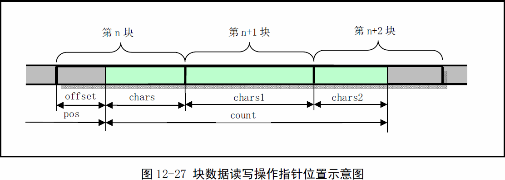
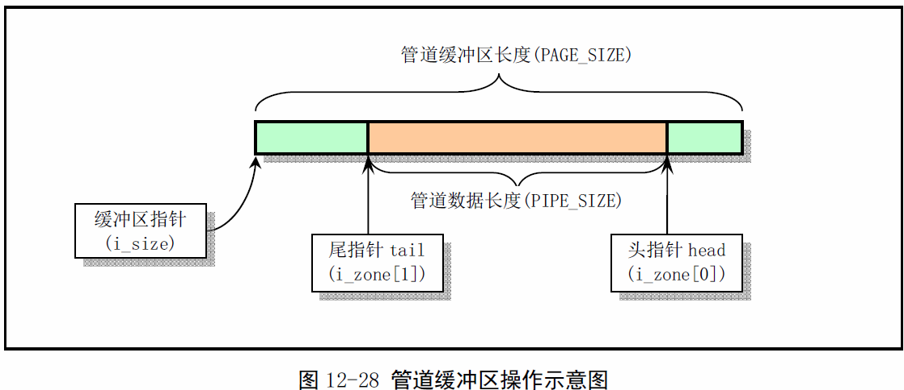

《Linux0.11内核完全注释》读书笔记之file
----------------------------------------------
[TOC]

>**注意：**由驱动程序直接提供底层的read()和write()接口并注册到内核，
而不用集成到内核中，增加了驱动扩展的灵活性。

#file_table.c
	该程序目前为空,仅定义了文件表数组.

#具体设备文件接口
block_dev.c char_dev.c pipe.c file_dev.c和read_write.c
前4个程序为read_write.c提供服务，主要实现了文件系统的数据访问
操作。


##block_dev.c
block_dev.c程序属于块设备文件数据访问操作类程序。包括block_read()和
block_write()两个块设备读写函数，分别用来直接读写块设备上的原始数据。
（其实是在高速缓冲区中进行）


##file_dev.c
该文件包括file_read()和file_write()两个函数。也是供系统调用函数read()
和write()调用，用于对普通文件进行读写操作。

##pipe.c
管道操作是进程间通信的最基本的方式。本程序包括read_pipe()和write_pipe()，
同时实现了管道系统调用sys_pipe()。
创建并初始化管道时，程序会专门申请一个管道i节点，并为管道分配一页缓冲区（
4KB)。


对于读管道操作，数据从管道尾读出，并使管道尾指针前移读取字节数个位置；对于
往管道中的写入操作，数据是想管道头部写入，并使管道头指针前移写入字节数个位
置。

read_pipe()用于读管道中的数据。若管道中没有数据，就唤醒写管道的进程，而自己
则进入睡眠状态。若读到了数据，就相应的调整管道头指针，并把数据传到用户缓冲区
中。当把管道中所有的数据都取走后，也要唤醒等待写管道的进程，并返回已读取的字
节数。当管道写进程已退管道操作时，函数就立刻退出，并返回已读的字节数。

系统调用sys_pipe()用于创建无名管道。它首先在系统的文件表中取得两个表项，然后
在当前进程的文件描述表中也同样寻找两个未使用的描述符表项，用来保存相应的文件
结构指针。接着再心痛中申请一个空闲i节点，同时获得管道使用的一个缓冲块。然后对
相应的文件结构进行初始化，将一个文件结构设置为只读模式，另一个设置为只写模式，
最后将两个文件描述符传给用户。

##char_dev.c
char_dev.c文件包括字符设备文件访问函数。主要有rw_ttyx()、rw_tty()、rw_memory()
h哦rw_char()。另外还有一个设备读写函数指针表。该表的项号代表主设备号。

```c
//字符设备读写函数指针表
static crw_ptr crw_table[]={
	NULL,			/* nodev */
	rw_memoty,		/* /dev/mem etc */
	NULL,			/* /dev/fd */
	NULL,			/* /dev/hd */
	rw_ttyx,		/* /dev/ttyx */
	rw_tty,			/* /dev/tty */
	NULL,			/* /dev/lp */
	NULL			/* unnamed pipes */
};

int rw_char(int rw, int dev, char *buf, int count, off_t *pos)
{
	crw_ptr call_addr;
	if(MARJOR(dev)>=NRDEVS)
		return -ENODEV;
	if(!(call_addr=crw_table[MAJOR(dev)]))
		return -ENODEV;
	return call_addr(rw, MINOR(dev), buf, count, pos);
}
```

##read_write.c
该文件实现了文件操作系统调用read()、write()和lseek()。read()和write()将
根据不同的文件类型，分别调用前面4个文件中实现的相应读写函数。因此本文件是
前面4个文件中函数的上层接口实现。

```c
int sys_read(unsigned int fd, char *buf, int count)
{
	struct file *file;
	struct m_inode *inode;
	if(fd>NR_OPEN||count<0||!(file=current->filp[fd]))
		return -EINVAL;
	if(!count)
		return 0;
	verify_area(buf, count);			//新的cpu能够实现页表权限检测
	inode = file->f_inode;
	if(inode->i_pipe)
		return(file->f_mode&1)?read_pipe(inode, buf, count):-EIO;
	if(S_ISCHR(inode->i_mode))
		return rw_cahr(READ, inode->i_zone[0], buf, count, &file->f_pos);
	if(S_ISBLK(inode->i_mode))
		return block_read(inode->i_zone[0], &file->f_pos, buf, count);
	if(S_ISDIR(inode->i_mode)||S_ISREG(inode->i_mode)){
		if(count+file->f_pos>inode->i_size)
			count = inode->i_size - file->f_pos;
		if(count<=0)
			return 0;
		return file_read(inode, file, buf, count);
	}
	printk("(Read)inode->i_mode=%06o\n\r", inode->i_mode);
	return -EINVAL;
}
```

##用户程序读写操作过程
通常，应用程序不直接调用Linux的系统调用，而是通过调用函数库如libc.a中的子
程序进行操作。对于一个基本的函数库来讲，通常需要提供以下一些基本函数：
>-系统调用接口函数
>-内存分配管理函数
>-信号处理函数集
>-字符串处理函数
>-标准输入输出函数
>-其他函数集

库中的字程序可以看作是应用程序与内核系统之间的中间层，它的主要作用除了提供一
些不属于内核的计算函数等功能函数外，还为应用程序提供“包裹函数”。这样一来可以
简化调用接口，二来可以在这些包裹函数中进行一些参数，出错处理，因此能使得程序
更加可靠稳定。

文件读写分别使用read和write系统调用，用户程序一般通过访问函数库中的read和
write函数来执行这两个系统调用。

```c
#define __LIBRARY__
#define <unistd.h>

_syscall3(int, read, int, fd, char*, buf, off_t, count)

int read(int fd, char *buf, off_t count)
{
	long __res;
	__asm__　volatile(
		"int $0x80"
		:"a" (__res)
		:"" (__NR_read), "b" ((long)(fd)), "c" ((long)(buf)), \
		"d" ((long)(count)));
	)
	if(__res>=0)
		return int __res;
	errno=-__res;
	return -1;
}
```
